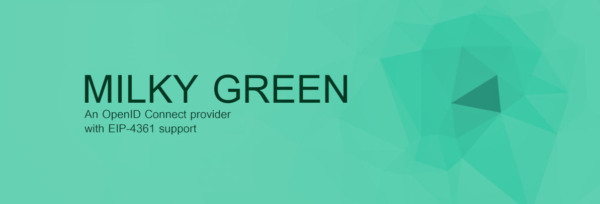

[](https://github.com/moonstoneid/milky-green/actions/workflows/docker-build-push.yml)


# Milky Green

Milky Green is a simple OpenID Connect provider that supports Sign-In with Ethereum
([EIP-4361](https://eips.ethereum.org/EIPS/eip-4361)).

Milky Green bridges the gap between web2 and web3, allowing Ethereum accounts to authenticate to
off-chain services that support OpenID Connect. Off-chain services can offer Sign-In with Ethereum
as a comfortable authentication method without any implementation effort. Web3 users can easily
authenticate to web2 providers without username/password using only their wallet.

## Quickstart

The easiest way to try Milky Green is via Docker Compose. The project contains a Docker Compose file
where everything is preconfigured to test the IdP locally.

1. __Start the IdP__

```bash
docker-compose \
  --project-name milkygreen \
  --file test/docker-compose.yml \
  up --detach
```

2. __Create an OAuth client__

The client has to be configured via the API. You can either use the following cURL command or use
SwaggerUI which is available at `http://127.0.0.1:8080/api`.

```bash
curl -X POST \
  http://127.0.0.1:8080/api/clients \
  --header 'X-Api-Key: OvyC8erWtrHEC77y' \
  --header 'Content-Type: application/json' \
  --data "@test/test_client.json"
```

3. __Authorize the OAuth client and retrieve OAuth tokens__
   
Open your browser and enter the following URL to start the authorization.

```
http://127.0.0.1:8080/oauth2/authorize?client_id=test&response_type=code&scope=openid%20profile%20email&state=12345&redirect_uri=http%3A%2F%2F127.0.0.1%3A8081%2Fauthorized
```

You will be asked to sign-in and grant permissions to the client to retrieve account information.

Once you granted the permissions, your browser will open the client's callback URL. Copy the
authorization code from the URL and use it to complete the authorization. You can do this with the
following cURL command or your favorite HTTP API client.

```bash
curl -X POST \
  http://127.0.0.1:8080/oauth2/token \
  --header 'Authorization: Basic dGVzdDp0ZXN0' \
  --header 'Content-Type: application/x-www-form-urlencoded' \
  --data 'grant_type=authorization_code&code=[CODE]&redirect_uri=http%3A%2F%2F127.0.0.1%3A8081%2Fauthorized'
```

As response, you should have received an access token, refresh token, and identity token.

4. __Query account information__

You can query account information with following cURL command or — as before — your favorite HTTP
API client.

```bash
curl -X GET \
  http://127.0.0.1:8080/userinfo \
  --header 'Authorization: Bearer [ACCESS_TOKEN]'
```

Here, the returned data only contains your account address. See
[OIDC Functionalities](#oidc-functionalities) for more information.

## Installation

### Prerequisites

MariaDB is used to store application data like OAuth client configuration. You need a MariaDB
database with version >= `5.5`.

### Configuration

__Basic configuration__

Basic configuration of e.g. database connection parameters is done via environment variables. The
project contains a template environment file with all available environment variables.

See: [Template environment file](.env.template)

Before starting the IdP, copy the template environment file and adjust it accordingly.

__Client & user configuration__

Currently, there is no UI to configure clients and users. Once you have started the IdP, you have to
use the API. SwaggerUI is available at `http(s)://[DOMAIN]/api`.

### Starting the IdP

The Docker image is available at `ghcr.io/moonstoneid/milky-green:1.0.0`.

Here is an example usage:

```bash
docker run \
  --name milkygreen \
  --env-file .env \
  --publish 8080:8080 \
   ghcr.io/moonstoneid/milky-green:1.0.0
```

## OIDC Functionalities

Currently, the returned account information is very basic.

By default, only following information is available.

- `sub`: Ethereum account address
- `preferred_username`: Ethereum account address

Once an Ethereum API URL (e.g. using Alchemy or Infura) is configured, additional account
information is retrieved from ENS and then following information is also available.

- `name`: Name (ENS key: `name`)
- `email`: Email address (ENS key: `email`)
- `website`: Website URL (ENS key: `url`)

## Contributing

Please use the [issue tracker](https://github.com/moonstoneid/milky-green/issues) to report any bugs.

If you would like to contribute code, fork the repository and send a pull request. When submitting
code, please make every effort to follow existing conventions and style in order to keep the code as
readable as possible.

## Disclaimer

This project has not undergone any formal security audit.

## Credits

Thanks to [@wyc](https://github.com/wyc) and [Spruce Systems, Inc.](https://github.com/spruceid) for
pushing EIP-4361 forward.

## License

This project is distributed under the Apache License, Version 2.0 (see LICENSE file).

By submitting a pull request to this project, you agree to license your contribution under the
Apache License, Version 2.0.